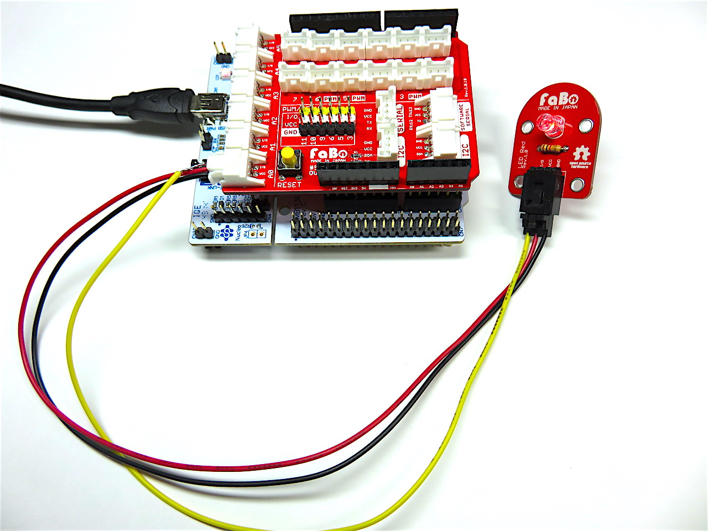

# #101 LED Brick

<center>
<!--COLORME-->

## Overview
LEDのBrickです。発光色は5色（青・緑・赤・白・黄）あります。Lチカのおともにもどうぞ。

※購入時は色の間違いにご注意ください。

## Connecting
アナログコネクタ(A0〜A5)、またはデジタルコネクタ(2〜13)のいずれかに接続します。



## Schematic


## Sample Code
A1コネクタにLED Brickを接続し、一定時間(1秒=1000ms)ごとに点灯/消灯（Lチカ）させています。

```c
int main(void)
{
  HAL_Init();
  SystemClock_Config();
  MX_GPIO_Init();
  while (1)
  {
		HAL_GPIO_TogglePin(GPIOA,GPIO_PIN_0);
		HAL_Delay(1000);
  }
}
```

## 構成パーツParts
- 5mm LED(各色)

## GitHub
- https://github.com/FaBoPlatform/FaBo/tree/master/101_led
