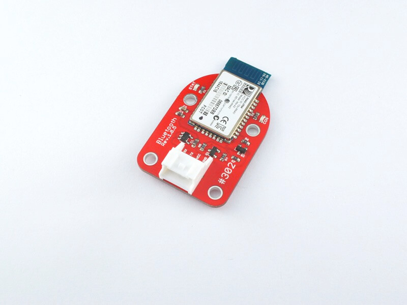
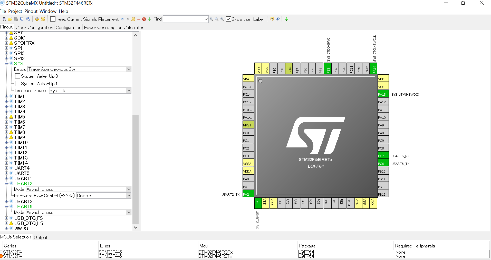
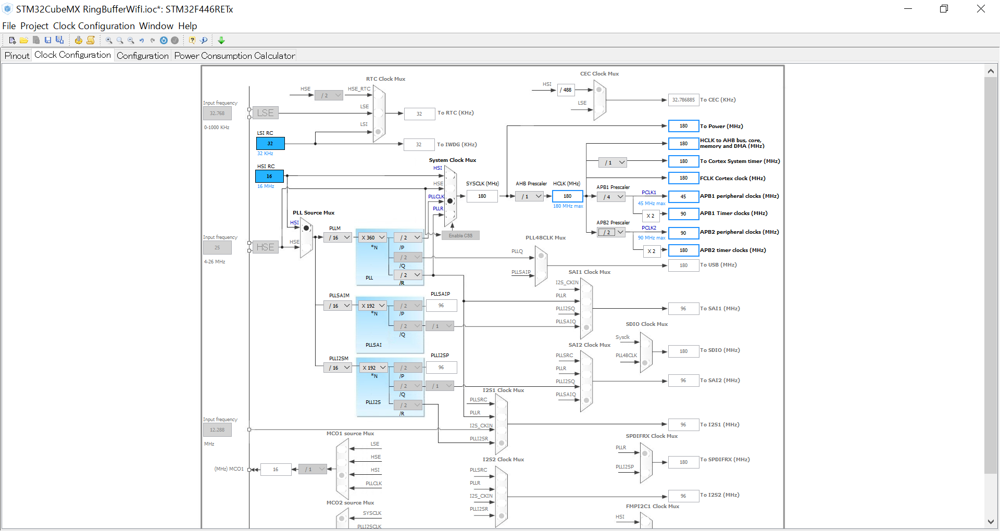
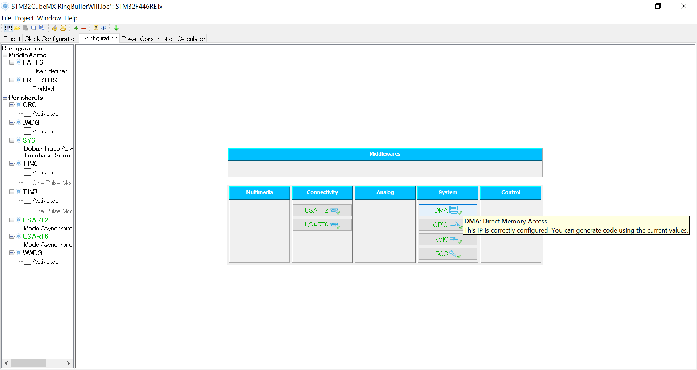
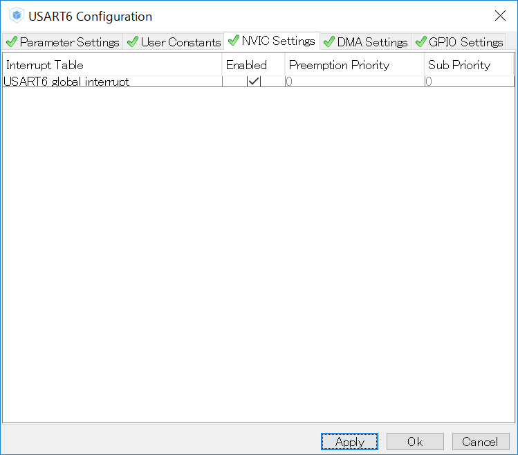
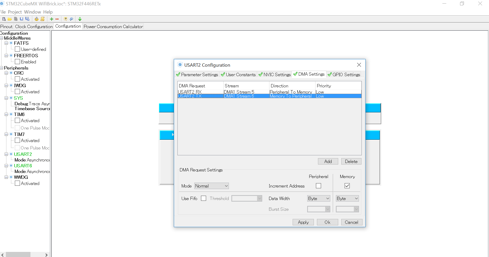
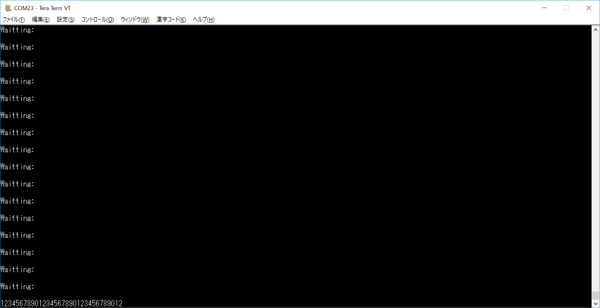
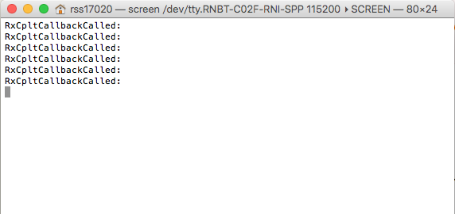

# #305 Buletooth Serial Brick


<!--COLORME-->

## Overview
Bluetooth通信ができるBrickです。

PCやスマートフォンなどの端末とシリアル通信することができます。

## Connecting
Wifi Brickは　Arduino D9,CN10 mopho pin 4pinに接続します。

###DMAによる通信
DMAはＣＰＵを仲介せず直接メモリにアクセスしデータを送受信します。その間は、ＣＰＵは他の処理ができるようになりますが、DMAがバスを使用しますので制限があります。
UART2はターミナルに表示。UART6をBluetoothBrickに接続します。BuletoothBrickの通信速度は115200bps（デフォルト）に設定します。
UART6から入力された文字がDMAによってメモリに格納され、格納された内容をUART2ヘ送信し、確認します。BuletoothBrickをNecleoに接続したら、他のパソコン等にBuletoothBrickとペアリングします。ターミナルソフトを起動し、115200bpsで接続します。

STM32CubeMXを起動しDMAが使用できるように設定します。
USART2,USART6をAnsynchrousに設定し有効にします。

下記のようにクロックを最大になるように、設定してください。

USART2,USART6を選択.

NVIC_SettingsでUSART2,USART6ともに有効にします。

DMAを選択し、UART2,UART6ともにADDします。



CodeGenerateします。
しばらくするとコードが自動生成されます。

宣言部です。バッファーは３２バイト（３２文字）に設定。各種、初期化する関数が含まれます。
```c
/* Includes ------------------------------------------------------------------*/
#include "stm32f4xx_hal.h"

/* USER CODE BEGIN Includes */

#include <stdio.h>
#include <string.h>

#define RXBUFFERSIZE 32
#define TXBUFFERSIZE 32

/* USER CODE END Includes */

/* Private variables ---------------------------------------------------------*/
UART_HandleTypeDef huart2;
UART_HandleTypeDef huart6;
DMA_HandleTypeDef hdma_usart2_rx;
DMA_HandleTypeDef hdma_usart2_tx;
DMA_HandleTypeDef hdma_usart6_rx;
DMA_HandleTypeDef hdma_usart6_tx;

__IO ITStatus uartstatus = RESET;

/* USER CODE BEGIN PV */
/* Private variables ---------------------------------------------------------*/

/* USER CODE END PV */

/* Private function prototypes -----------------------------------------------*/
void SystemClock_Config(void);
void Error_Handler(void);
static void MX_GPIO_Init(void);
static void MX_DMA_Init(void);
static void MX_USART2_UART_Init(void);
static void MX_USART6_UART_Init(void);

uint8_t TxBuffer[32];
uint8_t RxBuffer[32];

```

次にコールバック関数を記述します。
```c
//DMAの送信が完了したときに呼ばれる
void HAL_UART_TxCpltCallback(UART_HandleTypeDef *huart)
{
  uartstatus = SET;
	HAL_UART_Transmit(&huart6,(uint8_t*)RxBuffer,TXBUFFERSIZE,0x1100);
	char meassage[32];
	sprintf(meassage,"TxCpltCallbackCalled:\n\r");
  HAL_UART_Transmit(&huart6,(uint8_t*)meassage,strlen(meassage),0x1100);
}

//DMAの受信が完了したときに呼ばれる
void HAL_UART_RxCpltCallback(UART_HandleTypeDef *huart)
{
  uartstatus = SET;
	char meassage[32];
	sprintf(meassage,"RxCpltCallbackCalled:\n\r");
  HAL_UART_Transmit(&huart6,(uint8_t*)meassage,strlen(meassage),0x1100);
}

void HAL_UART_ErrorCallback(UART_HandleTypeDef *huart)
{
		char meassage[32];
	sprintf(meassage,"ErrorCallback:\n\r");
   HAL_UART_Transmit(&huart2,(uint8_t*)meassage,strlen(meassage),0x1100);
}
/* USER CODE END 0 */
```

以下main関数です。
```c

int main(void)
{

  /* USER CODE BEGIN 1 */


  /* USER CODE END 1 */

  /* MCU Configuration----------------------------------------------------------*/

  /* Reset of all peripherals, Initializes the Flash interface and the Systick. */
  HAL_Init();

  /* Configure the system clock */
  SystemClock_Config();

  /* Initialize all configured peripherals */
  MX_GPIO_Init();
  MX_DMA_Init();
  MX_USART2_UART_Init();
  MX_USART6_UART_Init();

  /* USER CODE BEGIN 2 */
	 if(HAL_UART_DeInit(&huart6) != HAL_OK)
  {
    Error_Handler();
  }
  if(HAL_UART_Init(&huart6) != HAL_OK)
  {
    Error_Handler();
  }


		char meassage[128];
	//バッファーへ送信
  if(HAL_UART_Receive_DMA(&huart6, (uint8_t *)RxBuffer, RXBUFFERSIZE) != HAL_OK)
  {
    Error_Handler();
  }

	//受信待機
  while (uartstatus != SET)
  {
	sprintf(meassage,"Waitting:\n\r");
  HAL_UART_Transmit(&huart2,(uint8_t*)meassage,strlen(meassage),0x1100);

  }
  //受信完了
	uartstatus = RESET;

		//UART2へ送信
		strcpy((char *)TxBuffer,(char *)RxBuffer);
		HAL_UART_Transmit(&huart2,(uint8_t*)TxBuffer,TXBUFFERSIZE,0x1100);

  while (uartstatus != SET);

	//送信完了
	uartstatus = RESET;

	/* USER CODE BEGIN WHILE */
  while (1)
  {

  /* USER CODE END WHILE */

  /* USER CODE BEGIN 3 */

  }
  /* USER CODE END 3 */

}

```
Macターミナルを起動（例）
*******-iMac:~ ******$>screen /dev/tty.RNBT-********-RNI-SPP 115200を入力し。
ターミナルから任意の入力。３２回目になるとバッファーがいっぱいになるので、下のように表示されます。
USART6から入力されたキーは、USART2に送信され下記のように表示されます。

USART2側


USART6側



UART6には、コールバック関数が呼ばれると上記のように表示されます。

## 構成Parts
-

## GitHub
