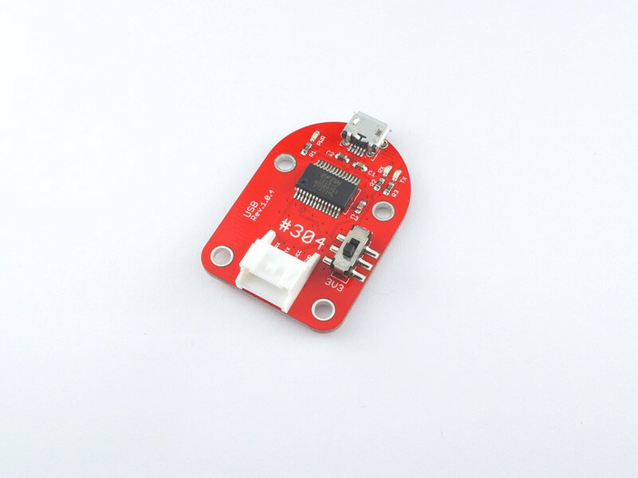
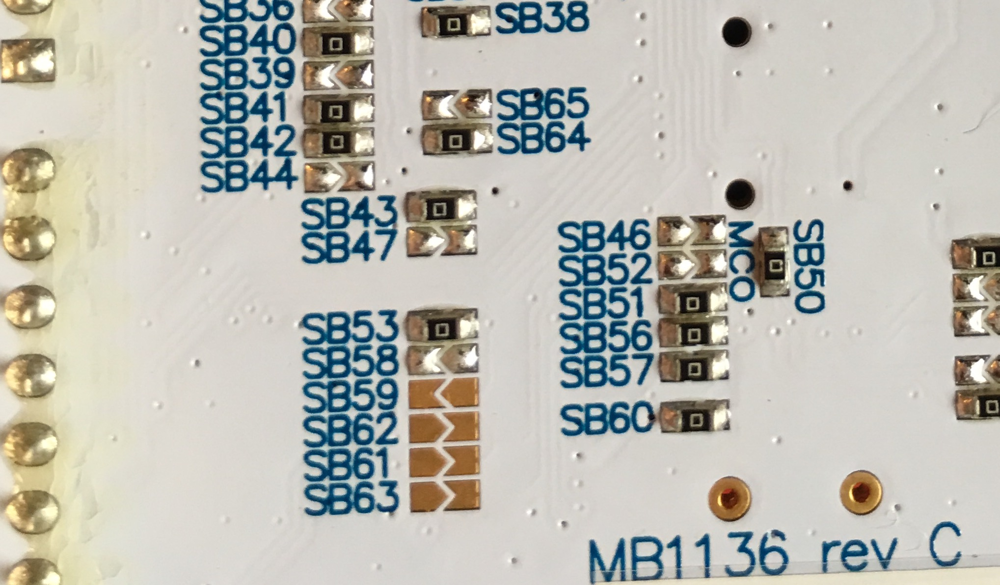
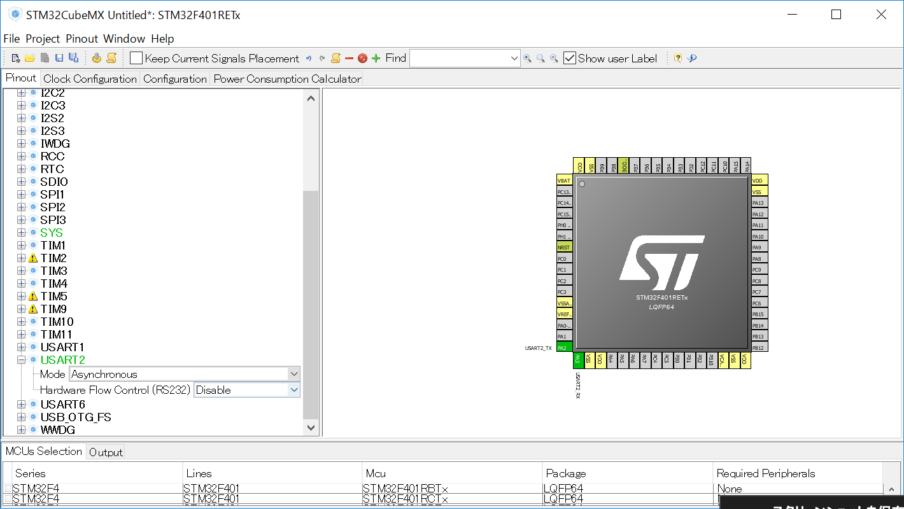
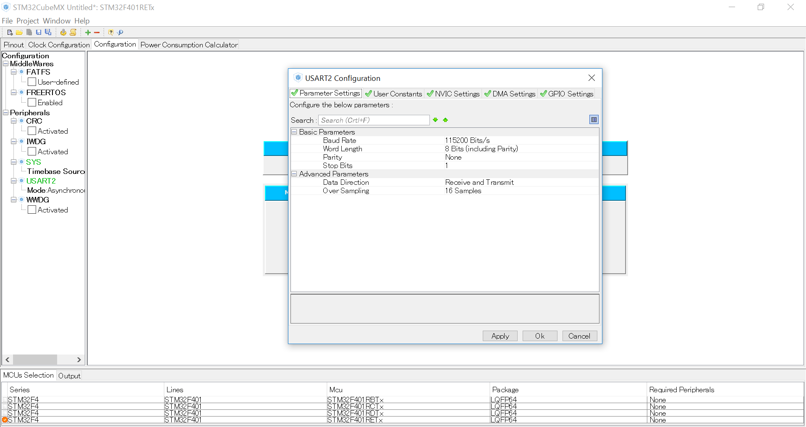

# #304 USB Serial Brick


<!--COLORME-->

## Overview
FT232RLを使用した、USBシリアル通信ができるBrickです。

## Connecting
Serialコネクタへ接続し、MicroUSBコネクタを他のデバイスに接続します。


## Sample Code
###ボードから送信のみ
ArduonoピンD0,D1をRX,TXとして使うため、SB62,SB63をはんだします。（注意：NecleoボードのSTLINKは、シリアル通信ができるので、従来は不要です。）


STM32CubeMXを起動してUART2を設定します。


115200bpsに設定がされているか確認します。


下記のコードMX_USART2_UART_Init関数が自動的に追加されます。必要に応じてボーレートを変更してください。

```c
/* USART2 init function */
static void MX_USART2_UART_Init(void)
{

  huart2.Instance = USART2;
  huart2.Init.BaudRate = 115200;
  huart2.Init.WordLength = UART_WORDLENGTH_8B;
  huart2.Init.StopBits = UART_STOPBITS_1;
  huart2.Init.Parity = UART_PARITY_NONE;
  huart2.Init.Mode = UART_MODE_TX_RX;
  huart2.Init.HwFlowCtl = UART_HWCONTROL_NONE;
  huart2.Init.OverSampling = UART_OVERSAMPLING_16;
  if (HAL_UART_Init(&huart2) != HAL_OK)
  {
    Error_Handler();
  }

}
```


下記のコードmain関数の中に追加します。

```c
int main(void)
{
  HAL_Init();
  SystemClock_Config();
  MX_GPIO_Init();
  MX_USART2_UART_Init();

	char message[15] ;
	int i = 101;

  while (1)
  {
		if (i<1000){
			sprintf(message,"Fabo Great Easy!%d\t",i);
			HAL_UART_Transmit(&huart2,(uint8_t*)message,strlen(message),0x1100);
			HAL_Delay(500);
			i++;
		}
  }

```

strlenを使用するので下記をコードに追記します。

```c
#include <stdio.h>
#include <string.h>
```
Arduinoシールドのリセットボタンを押し、ターミナルソフトを起動し確認します。

## 構成Parts
- スライドスイッチ

## GitHub

https://github.com/FaBoPlatform/FaBo/tree/master/117_slideswitch
