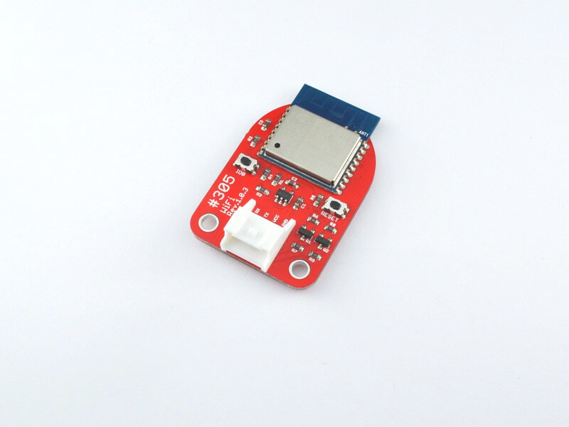
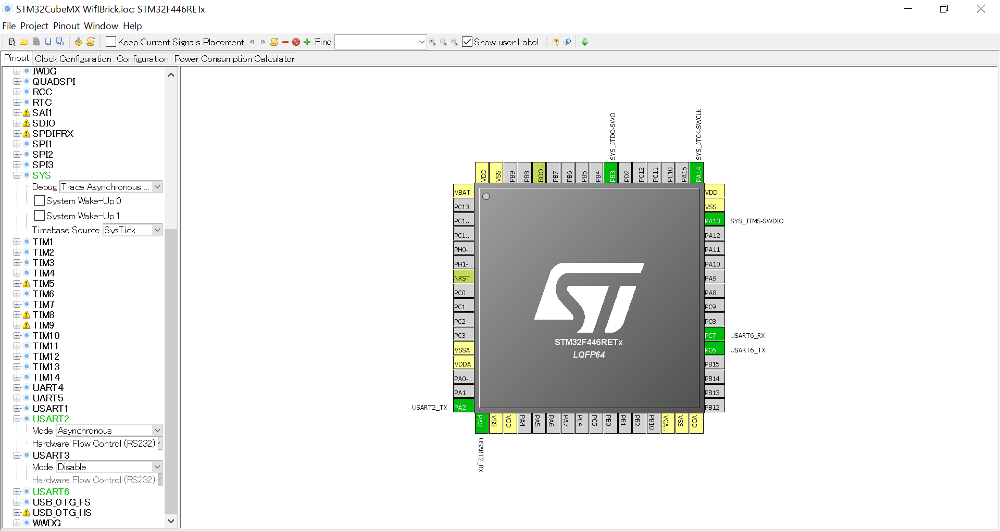
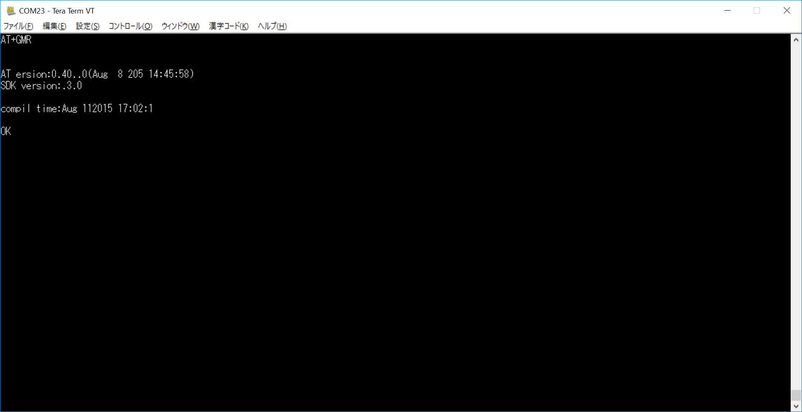

# #305 Wifi Serial Brick


<!--COLORME-->

## Overview
Wifi通信ができるBrickです。

## Connecting
Wifi Brickは　Arduino D9,CN10 mopho pin 4pinに接続します。

###ポーリングによるシリアル通信
WifiBrickにATコマンドによる命令をします。命令はAT+GMRです。このコマンドは、WifiBrickのファームウェアバージョンを返します。
ポーリングして受信を待機します。手軽ではありますが、ループしないとデータを取りこぼします。
UART2はターミナルに表示。UART6をWifiBrick接続します。WifiBrickの通信速度は115200bps（デフォルト）に設定します。



下記のようにクロックを最大になるように、設定してください。


CodeGenerateします。
下記のコードを追記します。

```c
/* Includes ------------------------------------------------------------------*/
#include "stm32f4xx_hal.h"

/* USER CODE BEGIN Includes */
#include <stdio.h>
#include <string.h>

/* USER CODE END Includes */

/* Private variables ---------------------------------------------------------*/
UART_HandleTypeDef huart2;
UART_HandleTypeDef huart6;

```

main関数
```c
int main(void)
{

  /* USER CODE BEGIN 1 */

  /* USER CODE END 1 */

  /* MCU Configuration----------------------------------------------------------*/

  /* Reset of all peripherals, Initializes the Flash interface and the Systick. */
  HAL_Init();

  /* Configure the system clock */
  SystemClock_Config();

  /* Initialize all configured peripherals */
  MX_GPIO_Init();
  MX_USART2_UART_Init();
  MX_USART6_UART_Init();

  /* USER CODE BEGIN 2 */

	  char message[15] ;

	HAL_Delay(5000);
	sprintf(message,"AT+GMR\r\n");
	HAL_UART_Transmit(&huart6,(uint8_t*)message,strlen(message),0x1100);

while (1)
  {
char c;				
					while(HAL_UART_Receive(&huart6,(uint8_t *)&c,1,1111)==HAL_TIMEOUT);
					HAL_UART_Transmit(&huart2,(uint8_t *)&c,1,1111);

  /* USER CODE END WHILE */


  /* USER CODE BEGIN 3 */

  }
  /* USER CODE END 3 */


```

TeraTermなどでファームウェアバージョンが表示されたら正常です。


## 構成Parts
-

## GitHub
