ARM開発するに必要なソフトウェアは、エディタ、コンパイラ、デバッカ、シュミレータなど複数必要ですが、IDE（統合開発環境）を使えば１つにまとまったソフトウェアとして提供されています。ARMマイコンを使用した開発が盛んになり開発環境もmbed,Keil,IAR,GCC利用のEclipseなどいくつかの選択肢がありますが、今回はARM社が開発したコンパイラが利用できるKeilで開発環境を構築します。eclipseなどは、コンパイラなども別にインストール必要がありますが、keilでコンパイル可能です。特徴として、mbedと異なりハードウェアに直接プログラミングでき、性能の追及やコードサイズがコンパクトになるベアメタルで開発可能となります。Keilの動作環境は、Windowsが必須となります。また、keilの無償版は32KBのコード制限があります。しかしながら、機能が単純な場合は十分な容量といえます。
流れとしては、ドライバをインストール→Keilのインストール→ターゲットとなるボードの設定→必要なコンポーネントをインストール→書き込みの設定となります。

NUCLEO-F401RE導入の場合
  主なスペック
    Nucleo type:Nucleo64(High-performance)
    MCU:STM32F401RET6(ARM 32bit Cortex-M4)
    MCU pin:64
    Flash:512KB
    RAM:96KB
    Interface:SPI(3),I2S,I2C,USART(3),USB-OTG,SDIO(Secure Digital I/O)
    WDT(2),ADC(12bit/10ch),RTC(Real Time Clock),TIM
    GPIO:50
    Connectors(Arduino UNO Rev3,ST morpho)

開発者登録する。
http://www.st.com/content/st_com/ja/products/evaluation-tools/product-evaluation-tools/mcu-eval-tools/stm32-mcu-eval-tools/stm32-mcu-nucleo/nucleo-f401re.html

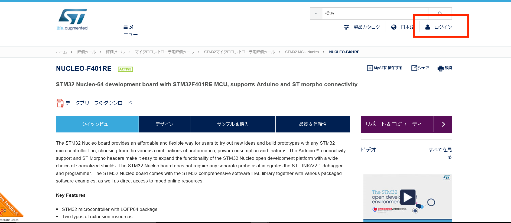

通常、ARM開発には、Keilなどの開発用ソフトウェア以外にも、ターゲットとなるCPUを制御してボードのメモリにファームウェアをダウンロードするJTAGエミュレータが必要になります。ARM開発において、JTAGエミュレータ（デバッガ）はJ-linkシリーズ（使用するマイコンやIDEによって必要とされるものは変わります）などよく使われますが、Necleoは、ファームウェアを書き込む（ダウンロード）ST-LINKデバッガ（ICE）を搭載済みで完成したら切り離すことが可能になっており、別途購入不要です。ST-LinkとターゲットとなるマイコンはSWD(SerialWireDebug)インターフェースで接続されている。JTAG５本線の信号線が必要ですが、省スペース化に対応したSWDは、信号線最低限２本(SWCLK,SWDIO)でボードにダウンロード可能です。信号線の他には電源とグランドとなる。

##JTAG　
４本から５本必要。
MCUを検査するバウンダリングスキャンが可能でデイジーチェーンにより複数台同時接続が可能。

| pin |  |
|:--|:--|
| TCK | クロック信号 |
| TMS | モードセレクト |
| NRST | リセット |
| TDI | データ入力 |
| TDO | データ出力 |

##SWD
少なくても２本(SWCLK,SWDIO)必要。トレース機能を利用したい場合はSWOを追加します。

| pin |  |
|:--|:--|
| SWCLK | クロック信号 |
| SWDIO | データ |
| NRST | リセット |
| SWO | データ出力（オプション） |

ST-LINK/V2ドライバダウンロード

http://www.st.com/content/st_com/ja/products/embedded-software/development-tool-software/stsw-link009.html

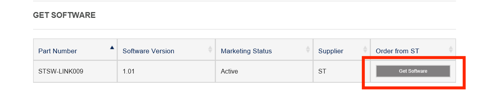

ST-LINK/V2ドライバインストール

ST-LINK/V2のファームウェアをダウンロードする。
https://my.st.com/content/my_st_com/en/products/embedded-software/development-tool-software/stsw-link007.html

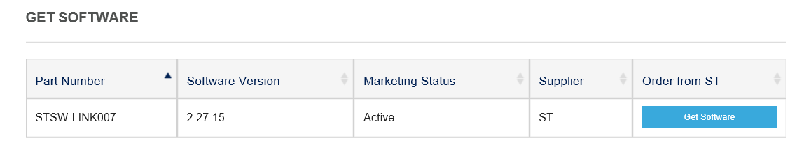

ST-LINK/V2のファームウェアをアップデートする。
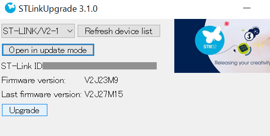

NecleoをUSBポートに接続する。

keil μVersion5のダウンロード
https://www.keil.com/download/product/

MDK-ARMを選択する。
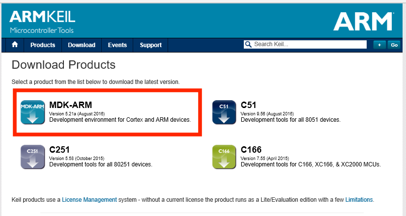

keil5を起動。ターゲットとなるデバイスを選択する。
下記のボタン（PackInstaller）を押します。
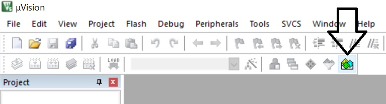

メニューバーのProjectを選択。次にSTmicroelectronics→STM32F401→STM32F401RB→STM32F401RBを選択します。
必要となるコンポーネントを選択する。
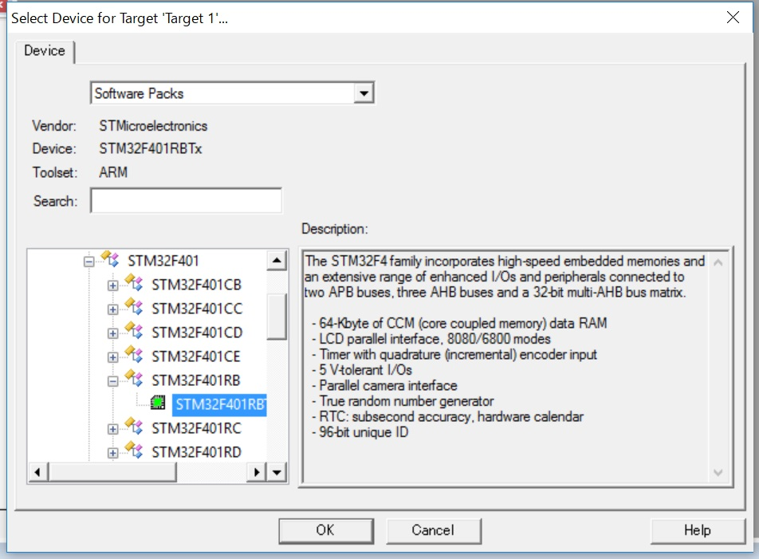

参考 ARM KEIL Board Support
file:///C:/Keil_v5/ARM/PACK/Keil/MDK-Middleware/7.0.0/Doc/Board/html/index.html
参考　CMSIS-CORE
file:///C:/Keil_v5/ARM/PACK/ARM/CMSIS/5.0.0-Beta4/CMSIS/Documentation/Core/html/index.html
参考　CMSISの説明
http://www.arm.com/ja/products/processors/cortex-m/cortex-microcontroller-software-interface-standard.php

ユーザー登録する。 住所、名前などを登録してダウンロードする。
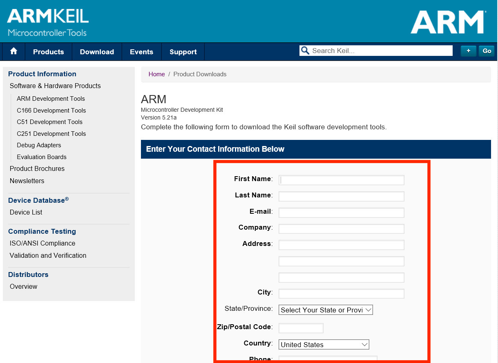

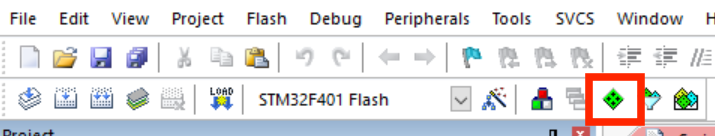

上のBoardsタブを押して、その下のNUCLEO-F401RE（Rev.C）の下DevicesのSTM32F401RBを選択、左にある任意のInstallボタンします。
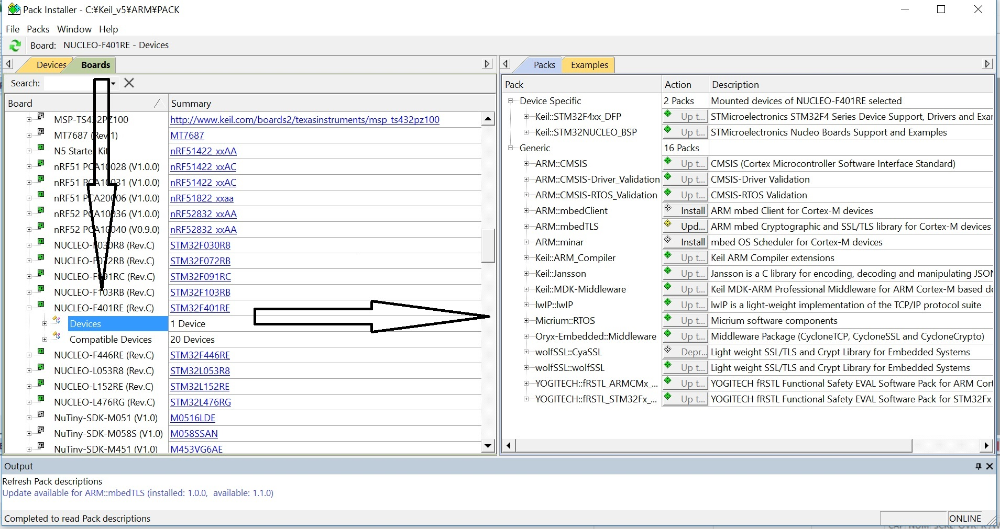

下記の示すOptionForTargetボタンを押します。
同じARMのコアですが、それ以外は異なるのでメーカーによって設定が必要になります。
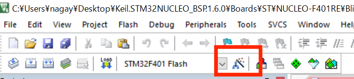

Targetタブをクリックし下記の通りに振動数、アドレス設定します。
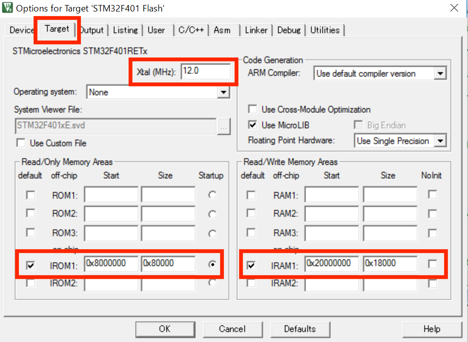

Debugタブを押して、ST-Link Debuggerを選択。
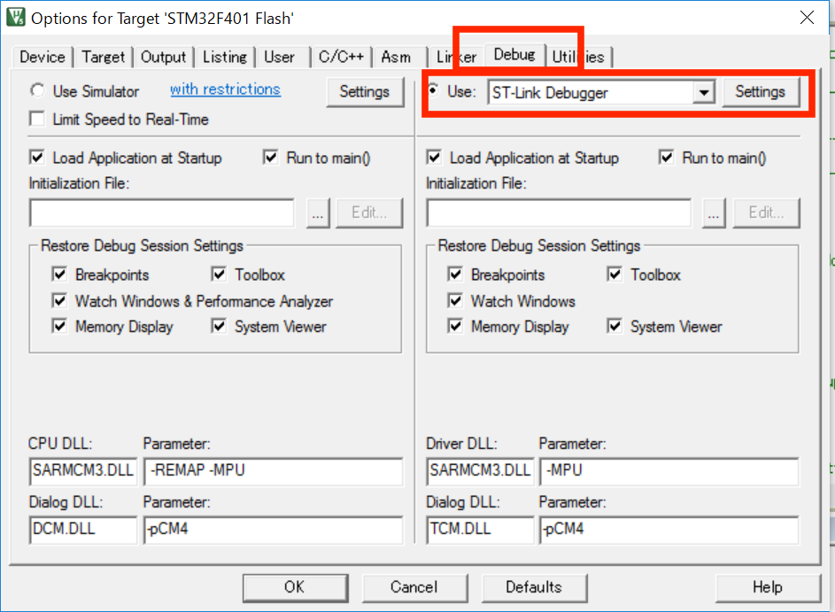

下記の設定になっているか確認してください。相違があれば変更してください。
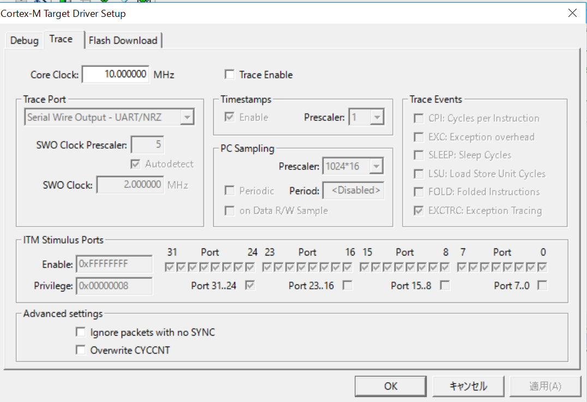

Flashタブを押して、下記の設定にしてください。ProgramingAlgorithmが下記と相違する場合は、必要に応じてAdd,Removeボタンで変更してください。
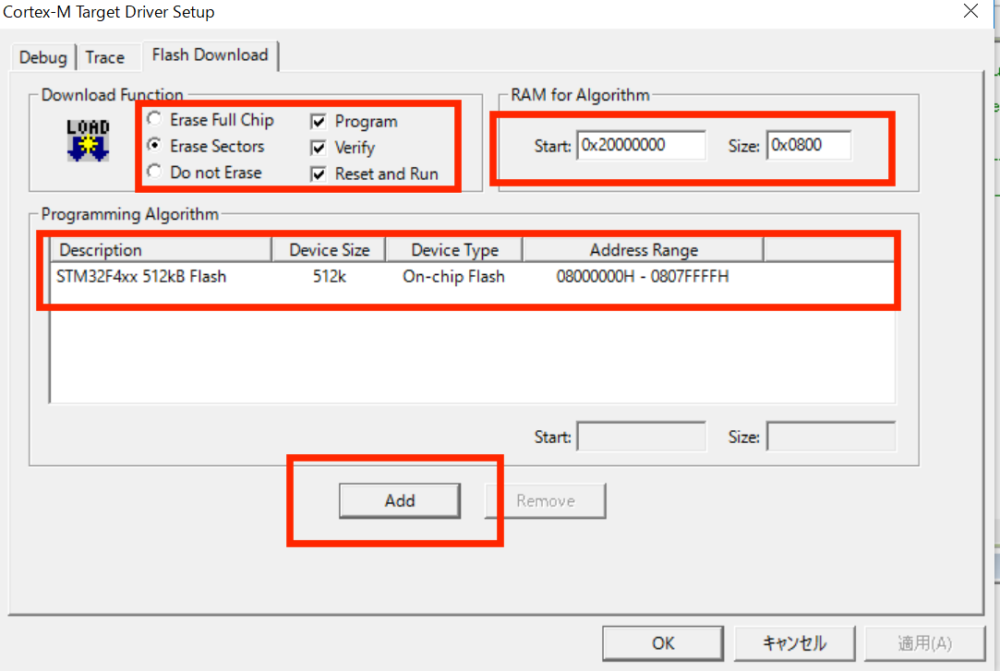

上記でAdd,Removeボタンを押すと、下記の画面が出ます。下の画面のように選択してAddボタンを押してください。
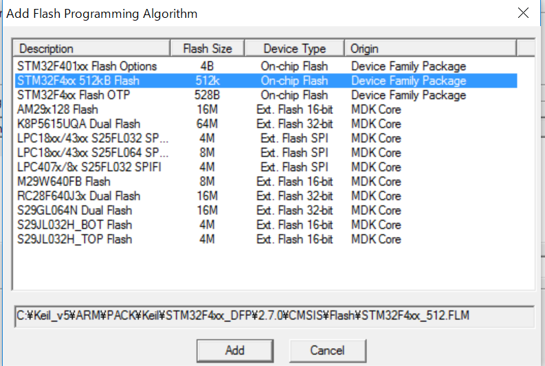
